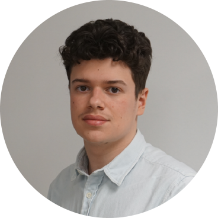
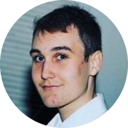
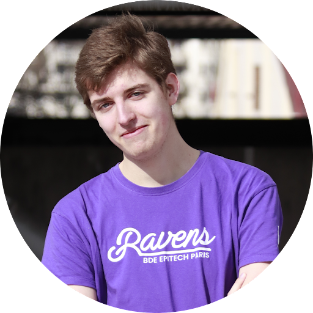
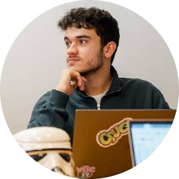

# Studio17

## The Studio17 is a private group who work for public projects to have a better school life

 

### Creators:

&nbsp; &nbsp;

&nbsp; &nbsp;

&nbsp; &nbsp;

&nbsp; &nbsp;

&nbsp; &nbsp;

&nbsp; &nbsp;

 

---

